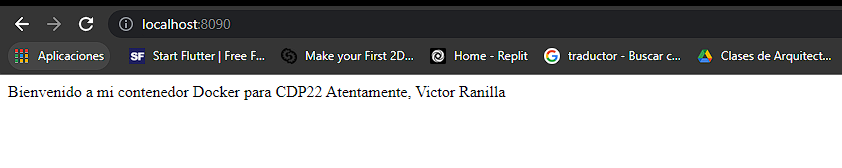
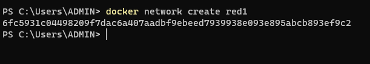
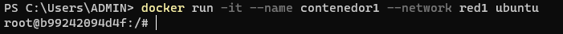
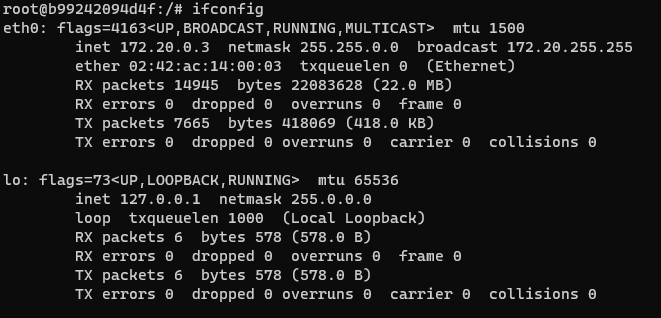
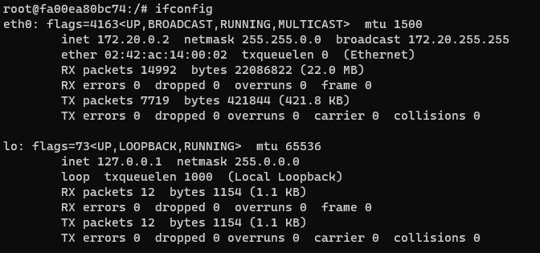
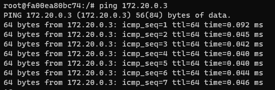

<div align="center">
<table>
    <theader>
        <tr>
            <th></th>
            <th>
                <span style="font-weight:bold;">UNIVERSIDAD LA SALLE</span><br />
                <span style="font-weight:bold;">FACULTAD DE INGENIERÍAS</span><br />
                <span style="font-weight:bold;">DEPARTAMENTO DE INGENIERÍA Y MATEMÁTICAS</span><br />
                <span style="font-weight:bold;">CARRERA PROFESIONAL DE INGENIERÍA DE SOFTWARE</span>
            </th>            
        </tr>
    </theader>
    
</table>
</div>

<div align="center">
<span style="font-weight:bold;">GUÍA DE LABORATORIO</span><br />
</div>

<table>
    <theader>
        <tr><th colspan="2">INFORMACIÓN BÁSICA</th></tr>
    </theader>
<tbody>

<tr><td>TÍTULO DE LA PRÁCTICA:</td><td>Docker</td></tr>
<tr><td colspan="2">RECURSOS:
    <ul>
        <li><a href="https://www.docker.com/">Sitio oficial del Proyecto Docker</a></li>
        <li><a href="https://github.com/moby/moby">El Proyecto Moby</a></li>
        <li><a href="http://www.haifux.org/lectures/320/netLec8_final.pdf">Contenedores de Linux y la nube del futuro</a></li>
        <li><a href="https://dondocker.com/orquestando-contenedores-docker-para-tener-un-joomla-y-un-mysql-en-diferentes-hosts/">Joomla y MySQL con Docker</a></li>
        <li><a href="https://www.youtube.com/watch?v=VeiUjkiqo9E#t=60">Tutorial de docker en Youtube</a></li>
        <li><a href="https://web.archive.org/web/20130808043357/http://www.linux.com/news/enterprise/cloud-computing/731454-docker-a-shipping-container-for-linux-code/">Docker: un 'Desplegador de contenedores' para el código de Linux</a></li>
        <li><a href="https://www.ionos.es/digitalguide/servidores/configuracion/tutorial-docker-instalacion-y-primeros-pasos/">Tutorial de Docker: instalar y gestionar la plataforma de contenedores</a></li>
        <li><a href="https://hub.docker.com/">Docker Hub</a></li>
        <li><a href="https://www.digitalocean.com/community/tutorials/how-to-install-and-use-docker-on-ubuntu-20-04-es">Cómo instalar y usar Docker en Ubuntu 20.04</a></li>
    </ul>
</td>
</<tr>
<tr><td colspan="2">DOCENTES:
    <ul>
        <li>Richart Smith Escobedo Quispe  - r.escobedo@ulasalle.edu.pe</li>
    </ul>
</td>
    </ul>
</td>
</<tr>
<tr><td colspan="2">ALUMNOS:
<ul>
<li>Ranilla Coaguila, Victor Andre - vranillac@ulasalle.edu.pe</li>
</ul>
</td>
</<tr>
</tdbody>
</table>

# Docker

[![License][license]][license-file]
[![Downloads][downloads]][releases]
[![Last Commit][last-commit]][releases]

[![Debian][Debian]][debian-site]
[![Git][Git]][git-site]
[![GitHub][GitHub]][github-site]
[![Vim][Vim]][vim-site]
[![Java][Java]][java-site]

#

## OBJETIVOS Y TEMAS

### OBJETIVOS
- Aprender a desplegar contenedores con Docker.

### TEMAS
- Docker.
- Docker vs VMs
- Arquitectura de Docker
- Comandos en Docker

## CONTENIDO DE LA GUÍA

### MARCO CONCEPTUAL

#### Docker

-   Docker es Software Libre.
-   Creado por Solomon Hykes en dotCloud <- Cloudlets. Liberado en marzo del 2013.
-   Crea contenedores livianos de software virtualizados en diferentes Sistemas Operativos.
-   Permite la ejecución de contenedores independientes.
-   Reduce la sobrecarga y el mantenimiento en comparación con las máquinas virtuales tradicionales.
-   Permite empaquetar una aplicación y sus dependencias en un contenedor virtual.
-   Permite la flexibilidad, portabilidad y la ejecución en cualquier medio compatible.

### Diferencias entre Docker y una Máquina Virtual (VM)

-   Docker no necesita crear sistemas operativos independientes.
-   Con Docker se construye sólo una vez y se ejecuta en cualquier lugar. Leer: [Docker: A 'Shipping Container' for Linux Code][Docker: A 'Shipping Container' for Linux Code]
-   Docker utiliza funcionalidades del kernel aislando recursos (CPU, Memoria, E/S, Net, etc.)
-   Docker simplifica la creación de Sistemas Distribuidos.
-   Docker es PaaS (Plataforma como servicio).
-   Docker se puede integrar facilmente con AWS, GCP, DO, MA, RHOS, etc.


     
    -   Fuente: [Tutorial de Docker: instalar y gestionar la plataforma de contenedores]

### Docker Engine

-   Docker engine es el motor de Docker.
-   Es el corazon de cualquier proyecto Docker.
-   Es una aplicación C/S.
-   Permite ejecutar contenedores.
-   Los contenedores de Docker se basan en imágenes.

    - Arquitectura del motor de Docker:
        - Docker-Daemon : Es un servidor que se ejecuta en el host y controla el motor de Docker. Se encarga de crear y gestionar todas las imágenes, contenedores, redes, etc.
        - API REST: Interfaz que permite a otros programas interactuar con el Daemon Docker por medio de instrucciones. (Ejemplo: Terminal).
        - La Terminal: Es la terminal del sistema opeativo como cliente del servidor a través de la API REST. Se usan scripts o comandos. Se puede ejecutar, parar o gestionar los contenedores con el comando docker.

    


### Imágenes/Contenedores en Docker

-   Son administradas por Docker-Daemon.
-   Las imágenes de Docker pueden ser creadas por el usuario a traves de la terminal.
-   La imágenes son plantillas de sólo lectura que tiene instrucciones que utiliza el motor de Docker paa crear un contenedor.
-   Una imágen se describen en un archivo de texto llamado Dockerfile.
-   Antes de iniciar un contenedor se carga un paquete con la imagen correspondiente.
-   Un contenedor es un proceso en ejecución de una imagen.


### Docker Hub

-   Es el Resgistro.
-   Es un repositorio de imágenes de Docker basado en la nube.
-   Es una biblioteca para imágenes Docker.
-   Es un servicio online que tiene repositorios (Publicos y privadod). Similar a GitHub.
-   URL de Docker Hub: [https://hub.docker.com/][Docker-Hub]


### Comandos Docker

-   Crear una imagen. Puede existir Dockerfile para esa imagen. (Local)
    ```sh
    docker build
    ```

-   Descargar una imagen de Docker Hub. (Remoto)
    ```sh
    docker pull
    ```

-   Iniciar un contenedor. (Local/Remoto)
    ```sh
    docker run
    ```

### Instalar el Motor Docker

-   Plataformas soportadas: https://docs.docker.com/engine/install/
-   GNU/Linux, MSWindows, macOS, etc.
-   Docker Desktop para MS Windows: https://docs.docker.com/desktop/windows/install/
-   Usar arquitectura 64 bits.
-   En producción utilizar en productos con LTS((Long Term Support).

-   En Distribuciones basadas en Debian GNU/Linux
    -   Actualizar las descripciones de paquete disponibles de manera local.
        ```sh
        sudo apt-get update
        ```
    
    -   Instalar paquetes adicionales. Opcional: Probado en Ubuntu Trusty 14.04. La instalación de estos paquetes puede no concretarse, lo cual no es impedimento para continuar.
        ```sh
        sudo apt-get install -y --no-install-recommends \
        linux-image-extra-$(uname -r) \
        linux-image-extra-virtual
        ```
    
    -   La computadora donde se realizó este manual tuvo las siguientes características: 
        ```sh
        sudo uname -rm
        ```
        ```sh
        5.10.0-13-amd64 x86_64
        ```
        ```sh
        sudo lsb_release -a
        ```
        ```sh
        No LSB modules are available.
        Distributor ID  :	Debian
        Description     :	Debian GNU/Linux 11 (bullseye)
        Release         :	11
        Codename        :	bullseye
        ```
        Nota: Al ser un Debian GNU/Linux las instalaciones anteriores no se pudieron ejecutar. Lo cual no debería preocuparte. ¡Continua!.

    -   Se puede instalar Docker manualmente con un paquete DEB, desde el repositorio de Docker o desde el repositorio de tu distribución.

    -   La forma recomendada para instalar Docker es a través del repositorio de Docker, así que esta será la forma que se realizará:

    -   Instalación de los paquetes necesarios para acceder al repositorio de Docker:
        ```sh
        sudo apt-get install -y --no-install-recommends \
        apt-transport-https \
        ca-certificates \
        curl \
        software-properties-common
        ```

    -   Añada la llave GPG del repositorio oficial de Docker a su sistema desde https://download.docker.com/linux/

    -   (a) Ejemplo para un sistema operativo Debian GNU/Linux:
        ```sh
        curl -fsSL https://download.docker.com/linux/debian/gpg | sudo apt-key add -
        ```
    
    -   (b) Ejemplo para un sistema operativo Ubuntu:
        ```sh
        curl -fsSL https://download.docker.com/linux/ubuntu/gpg | sudo apt-key add -
        ```
    
    -   Agregue el repositorio de Docker a las fuentes de APT:

    -   (c) Ejemplo para un sistema operativo Ubuntu:
        ```sh
        sudo add-apt-repository "deb [arch=amd64] https://download.docker.com/linux/ubuntu focal stable"
        ```
        dists: artful, bionic, cosmic, disco, eoan, focal, groovy, hirsute, impish, jammy, trusty, xenial, yakkety, zesty.
    
    -   (d) Ejemplo para un sistema operativo Debian GNU/Linux:
        ```sh
        sudo add-apt-repository "deb [arch=amd64] https://download.docker.com/linux/debian bullseye stable"
        ```
        dists: bullseye, buster, jessie, stretch, wheezy.
    
    -   Actualice el paquete de base de datos con los paquetes de Docker del repositorio recién agregado
        ```sh
        sudo apt update
        ```

    -   Verifique candidato para docker-ce:
        ```sh
        apt-cache policy docker-ce
        ```
        ```sh
        docker-ce:
            Instalados: 5:20.10.14~3-0~debian-bullseye or (none)
            Candidato:  5:20.10.16~3-0~debian-bullseye
            5:20.10.16~3-0~debian-bullseye 500
                500 https://download.docker.com/linux/debian bullseye/stable amd64 Packages
            ...
        ```

    -   Instale Docker:
        ```sh
        sudo apt install docker-ce
        ```
    
    -   Compruebe que funcione:
        ```sh
        sudo systemctl status docker
        ```

        ```sh
        ● docker.service - Docker Application Container Engine
            Loaded: loaded (/lib/systemd/system/docker.service; enabled; vendor preset: enabled)
            Active: active (running) since Mon 2022-05-16 17:26:47 -05; 18min ago
        TriggeredBy: ● docker.socket
            Docs: https://docs.docker.com
        Main PID: 1264 (dockerd)
            Tasks: 31
            Memory: 134.7M
                CPU: 1.103s
            CGroup: /system.slice/docker.service
                    └─1264 /usr/bin/dockerd -H fd:// --containerd=/run/containerd/containerd.sock
        ```


### Ejecutar el comando Docker sin sudo

-   Por defecto, el comando docker solo puede ser ejecutado por el usuario root o un usuario del grupo docker.

    ```sh
    sudo usermod -aG docker ${USER}
    ```

-   Ahora su usuario se agregó al grupo docker 
    ```sh
    id -nG
    ```

### Usar comandos docker

-   Opciones, comandos y argumentos
    ```sh
    docker [option] [command] [arguments]
    docker
    docker info
    docker images --help
    docker ps --help
    docker rm --help
    ```

-   Los contenedores de Docker se construyen con imágenes de Docker Hub(Por defecto).
    ```sh
    docker run hello-world
    ```
    ```sh
    Unable to find image 'hello-world:latest' locally
    latest: Pulling from library/hello-world
    2db29710123e: Pull complete 
    Digest: sha256:80f31da1ac7b312ba29d65080fddf797dd76acfb870e677f390d5acba9741b17
    Status: Downloaded newer image for hello-world:latest
    Hello from Docker!
    ```

-   buscar imágenes disponibles en Docker Hub
    ```sh
    docker search ubuntu
    ```

-   Descargar la imagen oficial de ubuntu a su ordenador:
    ```sh
    docker pull ubuntu
    ```

-   Ejecutemos un contenedor usando la imagen más reciente de Ubuntu
    ```sh
    docker run -it ubuntu
    
    root@c25d89d863b2:/#
    ```

-   Trabaja dentro del contenedor
    ```sh
    root@c25d89d863b2:/# apt-get update
    root@c25d89d863b2:/# apt-get install apache2
    root@c25d89d863b2:/# /etc/init.d/apache2 status
    root@c25d89d863b2:/# /etc/init.d/apache2 start
    root@c25d89d863b2:/# /etc/init.d/apache2 status
    root@c25d89d863b2:/# exit
    ```

-   Administrar contenedores de Docker
    ```sh
    docker ps
    docker ps -a
    docker ps -l
    docker start -i c25d89d863b2
    ```


## EJERCICIO RESUELTO POR EL DOCENTE
-   Crear un contenedor con las siglas del curso y el año actual
    ```sh
    docker run -it --name rcd22 ubuntu
    ```
    ```sh
    docker -ps -a
    CONTAINER ID   IMAGE         COMMAND    CREATED              STATUS                          PORTS     NAMES
    5f934a64ee98   ubuntu        "bash"     About a minute ago   Exited (0) About a minute ago             rcd22
    ```
   
-   Trabaje dentro del contenedor que acaba de crear: 
    -   Instale el servidor Web Apache HTTP server 2.x
    -   Tener un firewall UFW configurado para que restrinja el acceso a su servidor.
    -   Inicie por defecto Apache2.
    -   Cree una pagina de Bienvenida.

        ```sh
        root@5f934a64ee98:/# apt-get update
        root@5f934a64ee98:/# apt-get install apache2
        root@5f934a64ee98:/# /etc/init.d/apache2 status
        root@5f934a64ee98:/# /etc/init.d/apache2 start
        root@5f934a64ee98:/# /etc/init.d/apache2 status
        root@5f934a64ee98:/# apt-get install ufw
        root@5f934a64ee98:/# ufw app list
        root@5f934a64ee98:/# ufw allow 'Apache'
        root@5f934a64ee98:/# ufw app list
        root@5f934a64ee98:/# apt-get install systemctl
        root@5f934a64ee98:/# apache2ctl enable apache2
        root@5f934a64ee98:/# echo "Bienvenido a mi contenedor Docker para RCD22" > /var/www/html/index.html
        root@5f934a64ee98:/# echo "Atentamente, Richart Escobedo" >> /var/www/html/index.html
        root@5f934a64ee98:/# cat /var/www/html/index.html
        ```  
-   crear una imagen  a partir de un contenedor:
    ```sh
    docker commit 5f934a64ee98 rcd22image
    ```

-   Instale una imagen que ya tenga el servidor Web Apache HTTP Server 2.x y ejecutela en el afitrion en un puerto determinado.
    ```sh
    docker search httpd
    docker run -p 8088:80 httpd
    ```

#

## EJERCICIOS PROPUESTOS

-   1. Realice los cambios necesarios para que la imagen que ud creo a partir de un contenedor personalizado se pueda acceder al servidor web desde el equipo anfitríon.
    ```sh
    docker run -p 8088:80 rcd22image
    ```
    
    Se realizan los mismos pasos realizados en el ejercicio resuelto por el docente.
    
            ```sh
        root@c1f4c261a4ef:/# apt-get update
        root@c1f4c261a4ef:/# apt-get install apache2
        root@c1f4c261a4ef:/# /etc/init.d/apache2 start
        root@c1f4c261a4ef:/# apt-get install ufw
        root@c1f4c261a4ef:/# ufw allow 'Apache'
        root@c1f4c261a4ef:/# apt-get install systemctl
        root@c1f4c261a4ef:/# systemctl enable apache2
        root@c1f4c261a4ef:/# echo "Bienvenido a mi contenedor Docker para CDP22" > /var/www/html/index.html
        root@c1f4c261a4ef:/# echo "Atentamente, Victor Ranilla" >> /var/www/html/index.html
        root@c1f4c261a4ef:/# cat /var/www/html/index.html
        ```  
    Se crea una imagen  a partir de un contenedor:
    ```sh
    docker ps -a
    CONTAINER ID   IMAGE     COMMAND              CREATED         STATUS                      PORTS     NAMES
    c1f4c261a4ef   ubuntu    "bash"               6 minutes ago   Up 6 minutes                          cdp22
    
    docker commit c1f4c261a4ef imagencdp22
    ```
    Se ejecuta la imagen añadiendo los comandos apache2ctl -D FOREGROUND
    ```sh
    docker run -p 8090:80 imagencdp22 apache2ctl -D FOREGROUND
    ```
    
    
-   2. Crear dos contenedores que puedan comunicarse: ping.

    Docker por defecto al momento de  crear los contenedores los asigna a una misma red. Se puede crear una nueva red con el siguiente comando
     ```sh
    docker network create [NombreRed]
    ```
    
    
    Al momento de crear los contenedores de ubuntu se especifíca la red que van a utilizar
    ```sh
    docker run -it —name [NombreContenedor] –network [NombreRed] ubuntu
    ```
    
    
    [Creacion de contenedor 2](d3.PNG)
    
    En cada contenedor se ejecutan los siguientes comandos.
    ```sh
    root@fa00ea80bc74:/# apt-get update
    root@fa00ea80bc74:/# apt-get install net-tools
    root@fa00ea80bc74:/# apt-get install iputils-ping
    root@fa00ea80bc74:/# ifconfig
    ```
    
    Con ifconfig se observa la dirección ip de cada contenedor.
    
    
    
    
    Con la información obtenida, se puede hacer ping desde un contenedor a otro.
    ```sh
    root@fa00ea80bc74:/# ping 172.20.0.3
    ```
    
    
-   3. Investigar acerca de la ejecución de programas con interfaz gráfica dentro de contenedores Docker.


    Usualmente Docker se usa para encapsular software del lado del servidor en paquetes reproducibles, estos son los contenedores. Se asegura un cierto grado de aislamiento entre contenedores. Además, los contenedores se pueden utilizar como bloques de construcción para sistemas que constan de varios servidores de software. 

    Sin embargo, es posible ejecutar aplicaciones con intefaz gráfica dentro de contenedores Docker para usarlas como componentes dentro de sistemas más grandes. Por ejemplo, si ejecutamos Firefox dentro de Docker, podemos tener una separación explícita del estado del navegador entre contenedores. Esto es beneficioso para cosas como la administración de redes sociales.


#

## CUESTIONARIO

- ¿Qué son los "cgroups" del kernel de Linux? y ¿Qué diferencia más interesante encontró entre las versiones 1 y 2?

   Los cgroups, son una característica del kernel de Linux que permite que los procesos se organizarán en grupos jerárquicos cuyo uso de varios tipos de recursos pueden entonces ser limitados y monitoreados. 
   La versión 1 permitía una cantidad arbitraria de jerarquías y cada jerarquía podía albergar cualquier cantidad de controladores. Si bien esto parecía proporcionar un alto nivel de flexibilidad, no era útil en la práctica. También, la versión 1 permitía que los subprocesos de un proceso pertenecieran a diferentes cgroups, esto no tenía sentido para algunos controladores y esos controladores terminaron implementando diferentes formas de ignorar tales situaciones.
   
   La versión 1 permitía que los subprocesos estuvieran en cualquier cgroup, lo que creaba un problema  en el que los subprocesos que pertenecían a un cgroup principal y sus cgroups secundarios competían por los recursos. Esto fue desagradable ya que competían dos tipos diferentes de entidades y no había una manera obvia de resolverlo. 
   
- ¿Qué son los "namespaces" del kernel de Linux? y ¿Cuáles son los tipos de "namespaces"?

  Los namespaces son una característica del kernel de Linux que divide los recursos del kernel de forma que un conjunto de procesos ve un conjunto de recursos mientras que otro conjunto de procesos ve otro conjunto diferente de recursos. Los recursos pueden existir en varios espacios. Desde la versión 5.6 del kernel hay 8 tipos de namespace. 
  
   Mount (mnt): Los namespaces de mount controlan los puntos de montaje. El indicador de clonación utilizado para crear un nuevo namespace de este tipo es CLONE_NEWNS, abreviatura de "NEW NameSpace".

   Process ID (pid): Proporciona procesos con un conjunto independiente de ID de proceso de otros namespaces. Están anidados, lo que significa que cuando se crea un nuevo proceso tendrá un PID para cada namespace desde su namespace actual hasta el namespace PID inicial. Al primer proceso creado en un namespace PID se le asigna el número de ID de proceso 1 y recibe la mayor parte del mismo tratamiento especial que el proceso de inicio normal.

   Network  (net); Un namespace de red contiene solo una interfaz de bucle invertido. Cada interfaz de red (física o virtual) está presente en exactamente 1 namespace y se puede mover entre namespace. Cada espacio de nombres tendrá un conjunto privado de direcciones IP , su propia tabla de enrutamiento, listado de sockets, tabla de seguimiento de conexiones, firewall y otros recursos relacionados con la red.

   Interprocess Communication (ipc): Los namespaces de IPC aíslan los procesos de la comunicación entre procesos al estilo SysV. 

   UTS: Los namespace UTS permiten que un solo sistema parezca tener diferentes nombres de host y dominio para diferentes procesos. 

   User ID (user): Los namespace de usuario son una función que proporciona aislamiento de privilegios y segregación de identificación de usuarios en varios conjuntos de procesos. Es posible construir un contenedor con aparentes derechos administrativos sin otorgar realmente privilegios elevados a los procesos de usuario. Los espacios de nombres de usuario están anidados y cada nuevo espacio de nombres de usuario se considera un elemento secundario del espacio de nombres de usuario que lo creó.

   Control group (cgroup): El tipo de namespace cgroup oculta la identidad del grupo de control del cual el proceso es miembro. Un proceso en un espacio de nombres de este tipo, al verificar de qué grupo de control forma parte cualquier proceso, vería una ruta que en realidad es relativa al grupo de control establecido en el momento de la creación, ocultando su verdadera posición e identidad del grupo de control. 

   Time: El namespace de tiempo permite que los procesos vean diferentes tiempos del sistema de manera similar al espacio de nombres UTS. Se propuso en 2018 y aterrizó en Linux 5.6, que se lanzó en marzo de 2020.
  
- ¿Qué diferencia puede resaltar entre LXC y libcontainer?

  Linux Containers (LXC) se usó antes de docker 0.9 es un controlador de ejecución de docker y ofreció una interfaz de espacio de usuario para las funciones de contención del kernel de Linux. Es muy específico de Linux. El 13 de marzo de 2014, con el lanzamiento de la versión 0.9 , Docker eliminó LXC como entorno de ejecución predeterminado y lo reemplazó con su propia biblioteca libcontainer. 
  
  Libcontainer es una abstracción, para admitir una gama más amplia de tecnologías de aislamiento, eso significa que Docker se está abstrayendo de su implementación original, permitiendo que otros proveedores (como CoreOS) implementen su propia versión de contenedores .

- Investigue acerca del malware Doki y explique brevemente.

  Doki es un malware que utiliza el servicio DynDNS y un algoritmo de generación de dominio único (DGA) basado en la cadena de bloques de criptomonedas Dogecoin para encontrar el dominio de su C2 en tiempo real.
  
  El malware también aprovecha los sistemas comprometidos para escanear aún más la red en busca de puertos asociados con Redis, Docker, SSH y HTTP. Los atacantes logran comprometer las máquinas host al vincular los contenedores recién creados con el directorio raíz del servidor, lo que les permite acceder o modificar cualquier archivo en el sistema.

  
- ¿Hasta que punto la empresa RedHat se ha comprometido con el proyecto Docker?

  Red Hat, Inc. es una empresa estadounidense que provee software de código abierto principalmente a empresas. Red Hat es conocida por su sistema operativo empresarial Red Hat Enterprise Linux y por la adquisición del proveedor de middleware empresarial JBoss. Red Hat crea, mantiene y contribuye a muchos proyectos de software libre. Ha adquirido muchos productos de software propietario y ha liberado el código de estos aplicativos como código abierto. El 28 de octubre de 2018, IBM anunció su intención de adquirir Red Hat por $ 33,4 mil millones, llevándose a cabo finalmente el 9 de julio del 2019.
  Red Hat se comprometió con el proyecto Docker desde 2013 y el apoyo que Docker recibió por parte de este fue profundo y constante pero en los últimos años este compromiso fue disminuyendo. Desde que Red Hat adquirió CoreOS a principios de 2018 hasta la actualidad, todo el apoyo se fue hacia Podman, el cual es buscaría hacerle competencia a Docker.

#

## REFERENCIAS
-   [Sitio oficial del Proyecto Docker][Docker-site]
-   [Proyecto Moby][Moby-Github]
-   [Diapositivas "Contenedores de Linux y la nube del futuro" por Rami Rosen][Containers-PDF]
-   [Docker para un proyecto Joomla-MySQL][Joomla-MySQL]
-   [Tutorial de Docker en Youtube][Docker-Tutorial-Youtube]
-   [Cómo instalar y usar Docker en Ubuntu 20.04][Cómo instalar y usar Docker en Ubuntu 20.04]

#

[license]: https://img.shields.io/github/license/rescobedoulasalle/git_github?label=rescobedoulasalle
[license-file]: https://github.com/rescobedoulasalle/git_github/blob/main/LICENSE

[downloads]: https://img.shields.io/github/downloads/rescobedoulasalle/git_github/total?label=Downloads
[releases]: https://github.com/rescobedoulasalle/git_github/releases/

[last-commit]: https://img.shields.io/github/last-commit/rescobedoulasalle/git_github?label=Last%20Commit

[Debian]: https://img.shields.io/badge/Debian-D70A53?style=for-the-badge&logo=debian&logoColor=white
[debian-site]: https://www.debian.org/index.es.html

[Git]: https://img.shields.io/badge/git-%23F05033.svg?style=for-the-badge&logo=git&logoColor=white
[git-site]: https://git-scm.com/

[GitHub]: https://img.shields.io/badge/github-%23121011.svg?style=for-the-badge&logo=github&logoColor=white
[github-site]: https://github.com/

[Vim]: https://img.shields.io/badge/VIM-%2311AB00.svg?style=for-the-badge&logo=vim&logoColor=white
[vim-site]: https://www.vim.org/

[Java]: https://img.shields.io/badge/java-%23ED8B00.svg?style=for-the-badge&logo=java&logoColor=white
[java-site]: https://docs.oracle.com/javase/tutorial/

[Docker-site]: https://www.docker.com/
[Moby-Github]: https://github.com/moby/moby
[Containers-PDF]: http://www.haifux.org/lectures/320/netLec8_final.pdf
[Joomla-MySQL]: https://dondocker.com/orquestando-contenedores-docker-para-tener-un-joomla-y-un-mysql-en-diferentes-hosts/
[Docker-Tutorial-Youtube]: https://www.youtube.com/watch?v=VeiUjkiqo9E#t=60

[Docker: A 'Shipping Container' for Linux Code]: https://web.archive.org/web/20130808043357/http://www.linux.com/news/enterprise/cloud-computing/731454-docker-a-shipping-container-for-linux-code/
[Tutorial de Docker: instalar y gestionar la plataforma de contenedores]: https://www.ionos.es/digitalguide/servidores/configuracion/tutorial-docker-instalacion-y-primeros-pasos/

[Docker-Hub]: https://hub.docker.com/

[Cómo instalar y usar Docker en Ubuntu 20.04]:https://www.digitalocean.com/community/tutorials/how-to-install-and-use-docker-on-ubuntu-20-04-es


[![Debian][Debian]][debian-site]
[![Git][Git]][git-site]
[![GitHub][GitHub]][github-site]
[![Vim][Vim]][vim-site]
[![Java][Java]][java-site]

[![License][license]][license-file]
[![Downloads][downloads]][releases]
[![Last Commit][last-commit]][releases]
